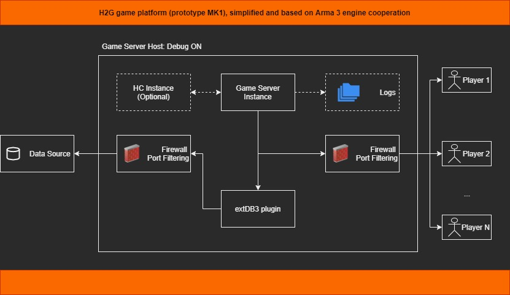
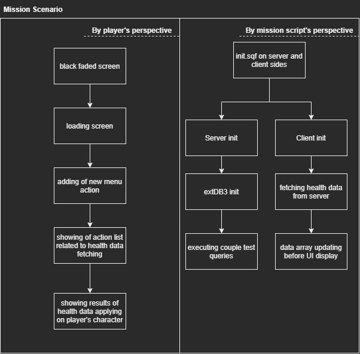
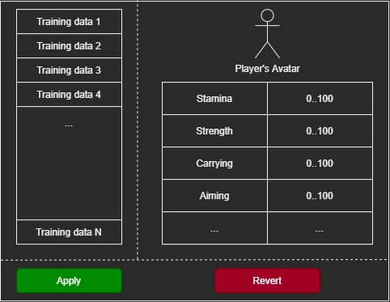

# H2G Game Connector

## Project status
The project has proof of concept state now.

## Description
Game connector module is supposed to be used by some game finally. As for first prototype Arma 3 game was chosen.
Reasons of that choice are next:
1) Available sources of game mission
2) Full access to server side where game can be run and tested
3) Full control of database - game communication. Game can be configured to fetch data from a local database where processed data will be stored

## Solution Architecture

Preliminar vision on arch was revised and simplified for boosting with further implementation process. Current arch version is shown below:  

## Mission design

Sample mission must look as easy as it's possible. First version of its structure is described below:  

## Affected UI

New UI screen (shown below) explains process of training data applying by a player.  

### Stack of technologies
Following tech stack is used:
1) MySQL rdbms
2) Arma 3 dedi server
3) ExtDB3 connector

## How to get started

## How to use

## License
MIT
